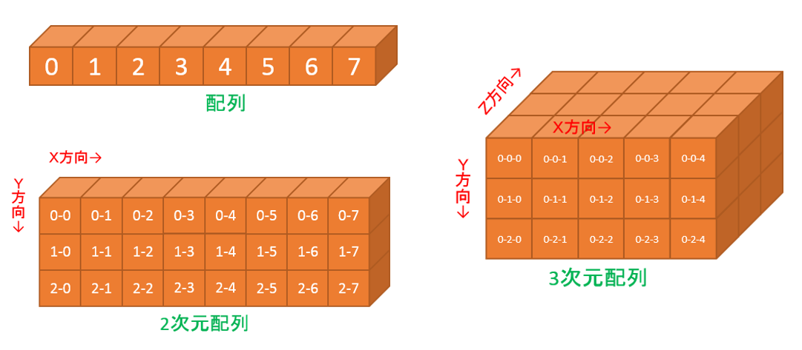
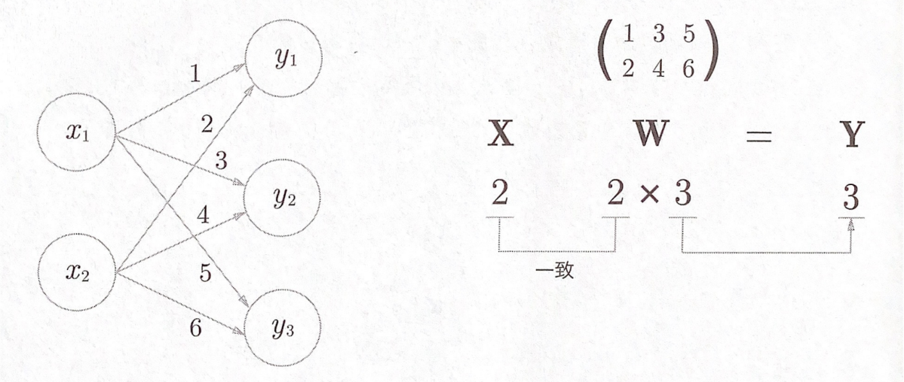

<!--
class: title
_paginate: true
-->

# 秋学期　深層学習ゼミ

3.3 多次元配列の計算

---

<!-- class: slides  -->

# 3.3.1 多次元配列

### **多次元配列**は数字の集合



---

# 多次元配列の作り方

```python
import numpy as np

# (1次元)配列
A = np.array([1, 2, 3, 4])
print(A)           # 配列の表示
print(np.ndim(A))  # 配列の次元
print(A.shape)     # 配列の形状
print(A.shape[0])  # 配列の形状（タプル）の1つ目の要素

# 2次元配列
B = np.array([[1, 2], [3, 4], [5, 6]])
print(B)
print(np.ndim(B))
print(B.shape)
```

---

# 行列 = 2 次元配列

$$
B =
\begin{bmatrix}
[1, & 2] \\
[3, & 4] \\
[5, & 6] \\
\end{bmatrix}(2次元配列)
 =
\begin{bmatrix}
1 & 2 \\
3 & 4 \\
5 & 6 \\
\end{bmatrix}(行列)
$$

$$
1\quad 2 \rightarrow 行\quad\quad
\begin{matrix}
1 \\
3 \\
5 \\
\end{matrix}
\rightarrow 列
$$

$$
Bは3\times2の配列, 3\times2の行列
$$

---

# 3.3.2 行列の積

#### 2×2 の場合


---

# 行列の積の性質

#### 行列の積には、以下の性質がある

- 行列の積は、「左の行列の列数」と「右の行列の行数」が等しくないと計算できない

- 「l×m の行列」と「m×n の行列」の積が、「l×n の行列」となる

$$
\begin{matrix}
A\\
l\times m
\end{matrix}
\qquad
\begin{matrix}
B\\
m\times n
\end{matrix}
\quad
=
\quad
\begin{matrix}
C\\
l\times n
\end{matrix}
$$

- AB と BA では結果は異なる

---

# 行列の積の計算方法

```python
# 行列の積（2×2）
A = np.array([[1, 2], [3, 4]])
B = np.array([[5, 6], [7, 8]])
print(A.shape)      # -> (2, 2)
print(B.shape)      # -> (2, 2)
print(np.dot(A, B)) # AとBの積を計算

# 行列の積（2×3と3×2）
A = np.array([[1, 2, 3], [4, 5, 6]])
B = np.array([[1, 2], [3, 4], [5, 6]])
print(A.shape)      # -> (2, 3)
print(B.shape)      # -> (3, 2)
print(np.dot(A, B))
print(np.dot(B, A)) # この2つは結果が異なる
```

---

# ニューラルネットワークの行列の積

<div style="text-align: center;">
  
  <p>入力と重みを行列として積を取ると出力になる</p>
</div>

---

# ニューラルネットワークの行列の積

```python
X = np.array([1, 2])  # 入力
W = np.array([[1, 3, 5], [2, 4, 6]]) # 重み
Y = np.dot(X, W) # 出力
print(Y)
```

- 関数を一回実行するだけで出力が求まる
  <br>
- ニューラルネットワークを実装する上で行列の積はとても重要

---

# まとめ

- 多次元配列は数字の集合、2 次元配列は行列と呼ばれる
  <br>
- 横の要素の並びを行、縦の要素の並びを列という
  <br>
- 「l×m の行列」と「m×n の行列」の積は、「l×n の行列」となる
  <br>
- ニューラルネットワークの実装において、行列の積はとても重要
